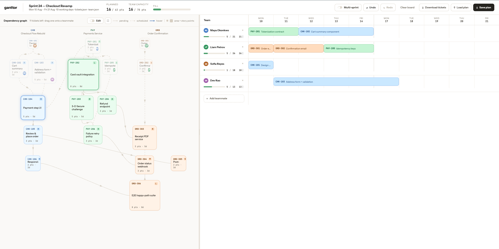
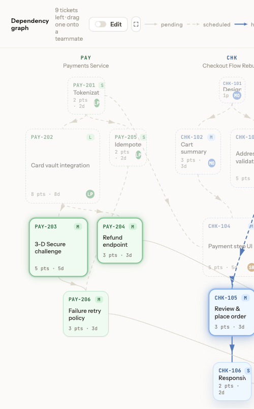
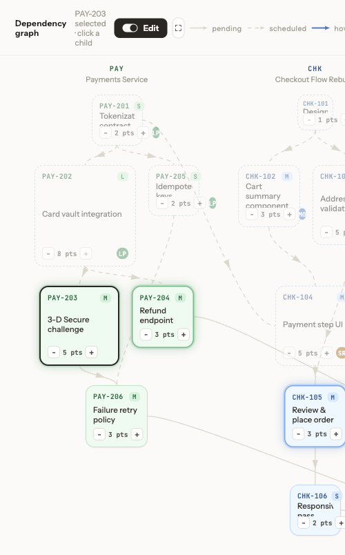
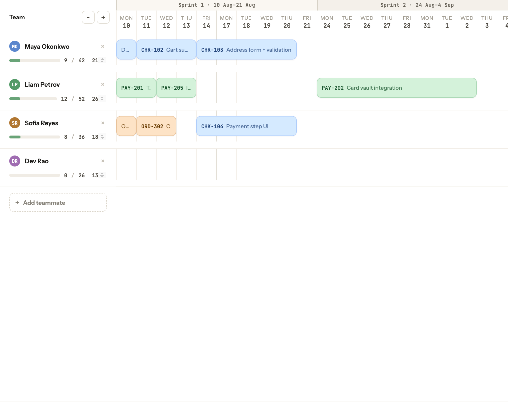

# ganttor

Most sprint planning tools miss the link between dependencies and capacity — that is why **ganttor** exists.

Local sprint planner: drag tickets from a dependency graph onto teammates and watch capacity fill on a Gantt board.



## See it

**Ready tickets** glow when their dependencies are already scheduled:



**Edit mode** — step story points (−/+) and two-click to add a dependency:



**Gantt + capacity** — bars across working days, utilization per teammate:



## What you get

- **Dependency graph** — tickets by epic, arrows for parent → child, pending vs scheduled deps  
- **Ready-ticket highlight** — unblocked work glows so you know what can go next  
- **Drag-and-drop assign** — drop onto a teammate; start day respects capacity, gaps, and deps  
- **Graph Edit** — step story points, add/remove deps (cycles blocked); plan refreshes after each change  
- **Gantt + capacity** — per-person bars, utilization, planned vs team capacity  
- **Multi-sprint, undo/redo, save/load** — plan beyond one sprint, ⌘Z history, download `sprint-plan.json` / `tickets.json`

## Try it

Serve the project over HTTP (the app loads JSON via `fetch`). First load needs the network for Google Fonts and the Design Component runtime.

```bash
npm start
# or: python3 -m http.server 8000
```

Open [http://localhost:8000/](http://localhost:8000/).

1. Sample checkout backlog ships in `data/tickets.json` and `data/team.json` — reload to fetch.  
2. Drag a glowing (ready) ticket onto a teammate; click a Gantt bar to unassign.  
3. Turn on **Edit** to change estimates or dependencies.  
4. Toggle **Multi-sprint** when work won’t fit in one sprint.  
5. **Save plan** / **Download tickets** to keep the schedule and backlog edits.

## Data files

| File | Role |
|------|------|
| `data/tickets.json` | Sprint meta, epics, sizes, tickets (`id`, `epic`, `title`, `pts`, `deps`) |
| `data/team.json` | People (`id`, `name`, `role`, `capacity`) |
| `sprint-plan.json` | Optional saved schedule (`gantt`, `capacityPlan`, totals) |

Reload reads from disk. **Download tickets** / **Save plan** trigger browser downloads — drop them into the project root (plan) or `data/` (tickets) when you want edits to stick. If the JSON files cannot be read, the app falls back to built-in sample data.

### Save / load (short)

- The plan stores **who/when**, not the backlog. `tickets.json` stays source of truth for titles, pts, and deps.  
- On load, **duration is recomputed** from current story points → days (saved `durationDays` is ignored).  
- Rows that don’t match a ticket or person are skipped; assignments are **repacked** so capacity and deps stay consistent.  
- Put a downloaded `sprint-plan.json` next to the HTML to auto-load on startup, or use **Load plan**.

## Tests

```bash
npm test
```

## License

MIT — see [LICENSE](LICENSE).
